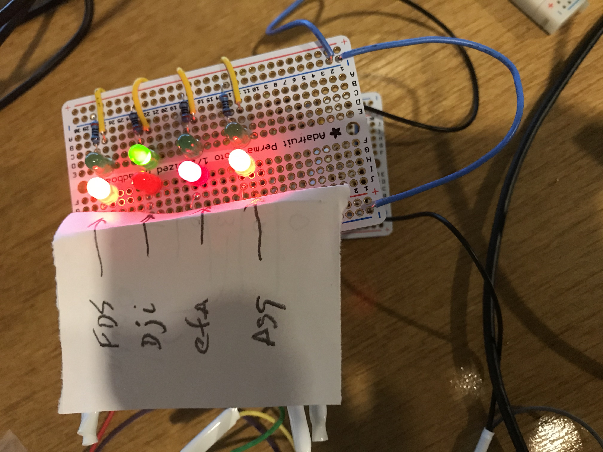
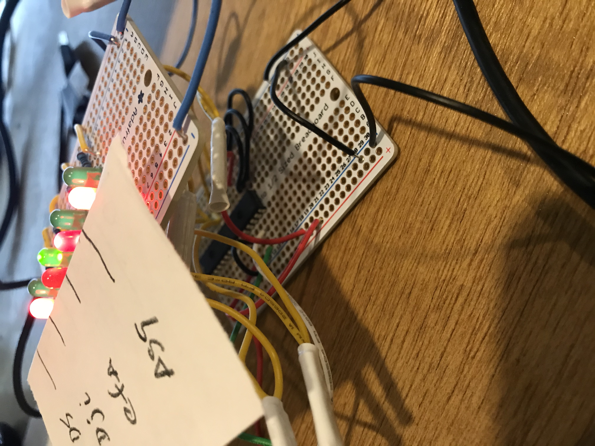

# stockpi
Monitor stock and update LEDs on a raspberry pi with GPIO and mcp23017 expander

# Purpose
A physical dashboard for your portfolio.
This requires an LED board with red/green lights for up/down. 
The code is using an MCP23017 from adafruit to use 2 i2c wires, power and ground to get 8 pins (4 stocks).
This leaves 8 pins opened to add more stocks.

